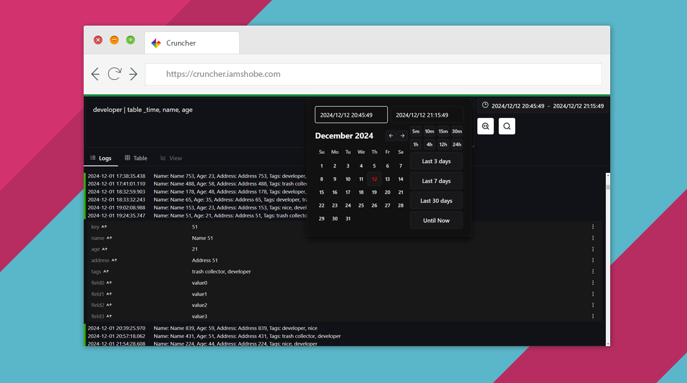

# Cruncher

Ever wanted to post process your data?  
`Cruncher` is here for the rescue!

---

Heavily inspired from `Splunk`, and other observability tools -  
it's main purpose is to allow post process data from multiple sources.  
Goal is to have a generic query language and to implement adapters to different backends - then you get all investigation capabilities right from the frontend.
Of course this comes with alot of calculation costs - but my assumption is that if the initial filter is done well - and results into small number of entries then all the post processing after that can be done entirely on the frontend.  

`Cruncher` was built with a mindset to be embedded everywhere - like inside an extension - so everything was built under unique [shadowDOM](https://developer.mozilla.org/en-US/docs/Web/API/Web_components/Using_shadow_DOM).  


## QQL (Quick Query Language)
QQL is the main query language inside `Cruncher` - it's main goal is to have a quick - easy to learn language - that's powerful enought to allow power users access to enhanced capabilities over that data.  

The query language was heavily inspired from Splunk (SPL2) and Kusto (KQL).  

### Syntax

#### Event
- event is the most basic bulding block of the input of cruncher - it contains a timestamp, message and object (key, value) of the inputed data.
You can use qql to search and filter specific events from the full log.

#### search terms
search terms -  
In qql every word before a `pipe` is considered a search token - e.g.:
```qql
token1 token2 abc 3
```
here we have 4 different search tokens.  
When querying the backend we use that as:  
`word LIKE %token1% AND word LIKE %token2% AND ....`
Meaning that we check of existence of that text inside the matched `event`.

To specify full sentences use doubleqoutes (`"`) -  
```
token1 "a full sentence" token2
```
here we have 3 total search tokens:
- token1
- a full sentence
- token2

#### table
table command allows you to create a table view of specified columns from the event list:
```
token1 | table column1, column2
```
the result would be a view with 2 columns - `column1` and `column2`.

#### stats
stats command allows you to reduce the input results into aggregated columns:
```
token1 | stats avg(column1) by column2
```

syntax:
```
<tokens>... | stats <aggregationFunction>(<columnName>) [by <columns command separated>...]
```

`by` statement allows you to group by specific columns - and the aggregation function will be applied to each group.

available functions:
- `avg` - input column must be of type `number` - avg of all column results in group
- `max` - input column must be of type `number` - max of all column results in group
- `min` - input column must be of type `number` - min of all column results in group
- `sum` - input column must be of type `number` - sum of all column results in group
- `count` - count of all column results in group
- `first` - first value of the column in the group
- `last` - last value of the column in the group


### Far Future plans
- [ ] offload calculation to a service worker.
